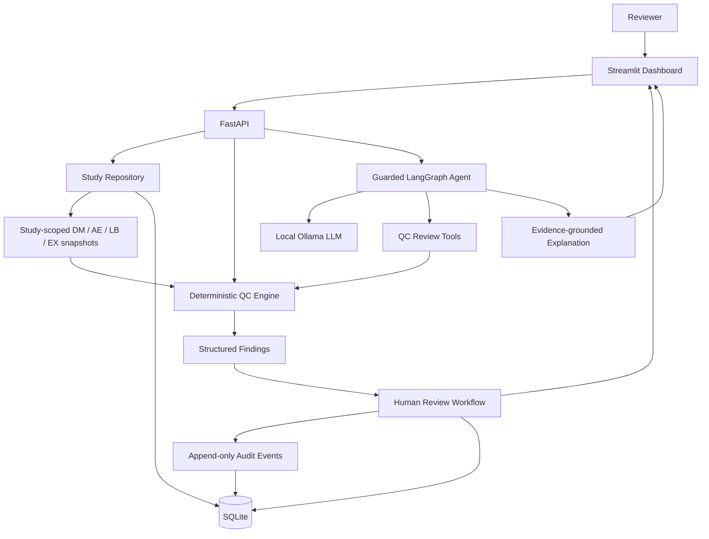
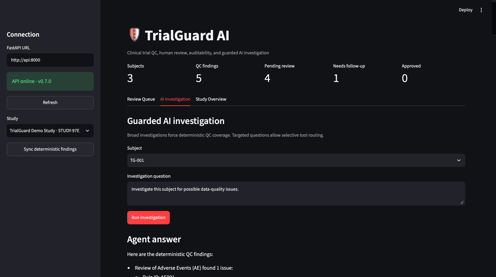
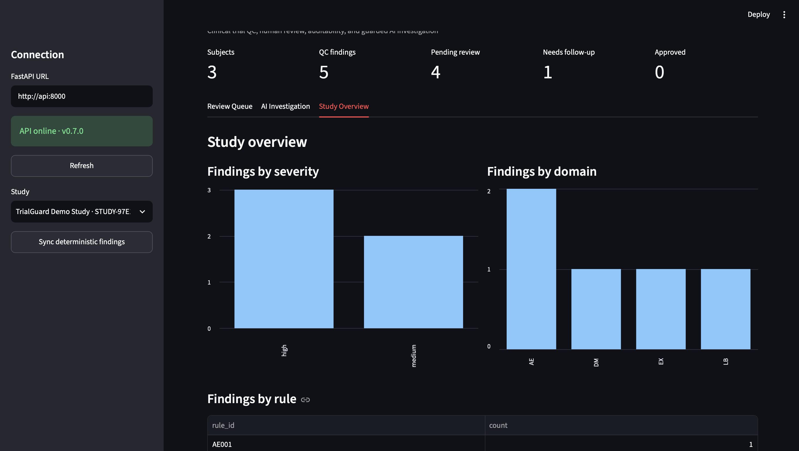
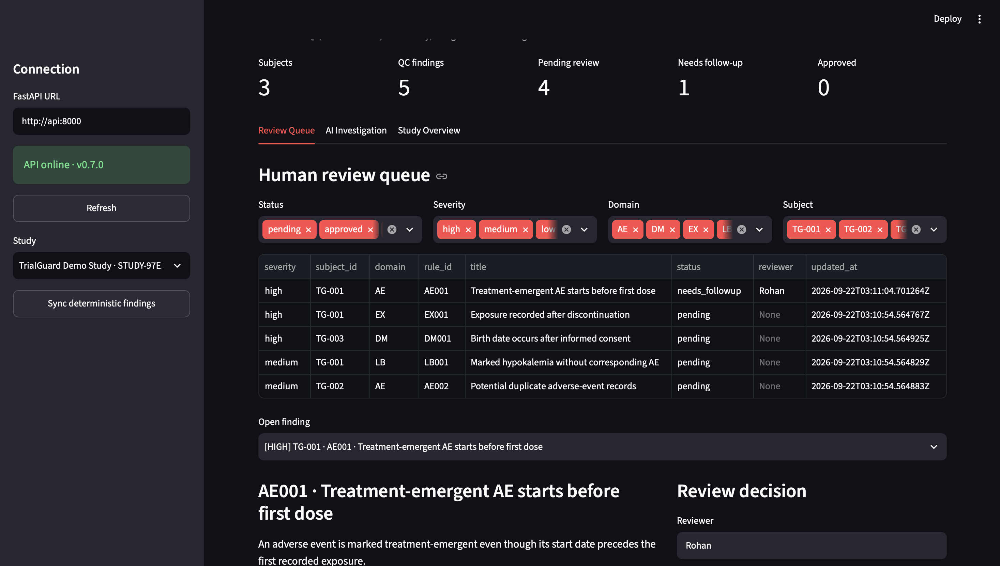

# TrialGuard AI

[](https://github.com/rohansingh72/trialguard-ai/actions/workflows/ci.yml)


**A guarded AI platform for clinical-trial data quality review, investigation, and human oversight.**

TrialGuard AI combines deterministic clinical-data QC with a local LangGraph/Ollama investigation agent, persistent human-review workflows, append-only audit history, and a reviewer dashboard. The central design principle is simple:

> **The LLM does not decide whether a clinical-data anomaly exists. Deterministic QC produces the evidence; the agent selects tools and explains that evidence; a human reviewer makes the final workflow decision.**

The project uses synthetic/demo clinical-trial data and is intended as an engineering portfolio project, not as validated software for clinical or regulatory use.

---

## Why TrialGuard?

Clinical-trial data review is a good example of where an LLM should **not** be the sole source of truth. Free-form model reasoning can be useful for investigation and explanation, but reproducible data-quality checks should remain deterministic and auditable.

TrialGuard separates those responsibilities:

- **Deterministic QC** detects defined anomalies from structured trial data.
- **Guarded AI orchestration** chooses review tools for targeted questions and summarizes deterministic evidence.
- **Human-in-the-loop review** supports approval, rejection, follow-up, notes, and audit history.
- **Persistent study isolation** keeps studies, review state, and audit records separate across restarts.
- **Production-oriented infrastructure** adds Docker Compose, CI, health/readiness checks, request IDs, and structured logging.

---

## Architecture



### Safety boundary

The clinical source snapshots are read-only within the review workflow.

```text
Clinical data
     ↓
Deterministic QC
     ↓
Structured evidence
     ↓
Guarded agent explanation
     ↓
Human review
     ↓
Review state + audit trail

No LLM-driven mutation of DM / AE / LB / EX
```

For a **broad subject investigation**, TrialGuard forces deterministic review across all implemented QC domains before the LLM summarizes the evidence.

For a **targeted question**, the LangGraph agent can select only the relevant deterministic tools.

---

## Core Capabilities

### Clinical-data ingestion and validation

TrialGuard accepts study-scoped CSV datasets for:

- `DM` — Demographics
- `AE` — Adverse Events
- `LB` — Laboratory Results
- `EX` — Exposure

Required schemas are validated before a study is persisted.

### Deterministic QC engine

The current portfolio release implements five QC rules:

| Rule | Domain | Check |
|---|---|---|
| `AE001` | AE | Treatment-emergent AE begins before first recorded dose |
| `AE002` | AE | Potential duplicate adverse-event records |
| `LB001` | LB | Potassium < 3.0 mmol/L without a potassium-related AE |
| `EX001` | EX | Exposure recorded after subject discontinuation |
| `DM001` | DM | Birth date occurs after informed consent |

The rule set is intentionally small and transparent so the focus remains on system architecture, evidence flow, evaluation, and human oversight.

### Guarded AI investigation

The agent layer uses:

- **LangGraph** for orchestration
- **Ollama** for local model execution
- `llama3.2:3b` as the default model
- deterministic QC functions exposed as read-only investigation tools

Example targeted question:

> Are there duplicate adverse events for this subject?

The agent can route to the AE review tool rather than running unrelated checks.

Example broad question:

> Investigate this subject for possible data-quality issues.

TrialGuard forces comprehensive deterministic QC coverage before the model produces a summary.

### Human review and audit trail

Each QC finding can move through:

```text
pending
approved
rejected
needs_followup
```

A reviewer can add notes, and every workflow transition is recorded as an audit event. Review decisions modify workflow metadata only; they do not alter the study source datasets.

### Multi-study persistence

Study metadata, human-review records, and audit events are stored in SQLite. Validated clinical source snapshots are persisted under separate study directories.

```text
.trialguard/
├── trialguard.db
└── studies/
    ├── STUDY-*/
    │   ├── DM.csv
    │   ├── AE.csv
    │   ├── LB.csv
    │   └── EX.csv
    └── ...
```

Review state survives API restarts.

### Reviewer dashboard

The Streamlit dashboard supports:

- persisted study selection
- study-level QC metrics
- deterministic finding synchronization
- filtering by status, severity, domain, and subject
- evidence inspection
- approve / reject / follow-up actions
- reviewer notes
- audit-history viewing
- guarded AI subject investigation
- study-level finding distributions

---

## Synthetic Benchmark

TrialGuard includes a reproducible synthetic benchmark generator with seeded ground-truth anomalies.

```bash
python synthetic_data/generate_benchmark.py --subjects 200 --seed 42
python evals/evaluate_qc.py --data benchmark_data
```

Result for the included 200-subject synthetic benchmark:

| Metric | Result |
|---|---:|
| Ground-truth anomalies | 50 |
| Predicted anomalies | 50 |
| True positives | 50 |
| False positives | 0 |
| False negatives | 0 |
| Precision | **1.000** |
| Recall | **1.000** |
| F1 | **1.000** |

**Important:** these results demonstrate that the deterministic engine correctly detects the anomaly patterns deliberately seeded into this synthetic benchmark. They are **not** an estimate of performance on real-world clinical-trial data.

---

## Tech Stack

| Layer | Technology |
|---|---|
| API | FastAPI |
| Language | Python 3.11 |
| Structured data | pandas |
| Validation | Pydantic |
| Agent orchestration | LangGraph |
| Local LLM | Ollama / `llama3.2:3b` |
| Reviewer UI | Streamlit |
| Persistence | SQLite + study-scoped CSV snapshots |
| Testing | pytest |
| Containers | Docker / Docker Compose |
| CI | GitHub Actions |
| Observability | JSON structured logs + `X-Request-ID` |
| Health checks | `/health` + `/ready` |

---

## Quick Start

### Option 1 — Local development

#### 1. Clone and create the environment

```bash
git clone https://github.com/rohansingh72/trialguard-ai.git
cd trialguard-ai

python3 -m venv .venv
source .venv/bin/activate
pip install -r requirements.txt
```

On Windows PowerShell:

```powershell
.venv\Scripts\Activate.ps1
```

#### 2. Start Ollama

```bash
ollama pull llama3.2:3b
ollama list
```

#### 3. Generate demo data

```bash
python synthetic_data/generate.py
```

#### 4. Start the API

```bash
uvicorn app.main:app --reload
```

Swagger:

```text
http://127.0.0.1:8000/docs
```

#### 5. Start the dashboard

In a second terminal:

```bash
source .venv/bin/activate
python -m streamlit run dashboard/app.py
```

Dashboard:

```text
http://localhost:8501
```

### Option 2 — Docker Compose

Make sure Docker Desktop and Ollama are running.

```bash
ollama pull llama3.2:3b
docker compose up --build
```

Open:

- Dashboard: `http://localhost:8501`
- Swagger: `http://localhost:8000/docs`
- Liveness: `http://localhost:8000/health`
- Readiness: `http://localhost:8000/ready`

If the API container needs to reach Ollama running on the host, use:

```text
TRIALGUARD_OLLAMA_BASE_URL=http://host.docker.internal:11434
```

Application state is persisted in the Docker named volume `trialguard-data`.

---

## Demo Workflow

A simple end-to-end demo:

1. Generate the bundled synthetic data.
2. Create a demo study from the dashboard or `POST /studies/demo`.
3. Synchronize deterministic QC findings into the review queue.
4. Open a finding and inspect its evidence.
5. Assign a reviewer and mark the finding `approved`, `rejected`, or `needs_followup`.
6. Confirm the audit event was persisted.
7. Open **AI Investigation**.
8. Ask a broad question such as:
   > Investigate this subject for possible data-quality issues.
9. Ask a targeted question such as:
   > Are there duplicate adverse events for this subject?
10. Restart the application and confirm the study and review state remain available.

---

## API Highlights

| Method | Endpoint | Purpose |
|---|---|---|
| `GET` | `/health` | Process liveness |
| `GET` | `/ready` | Database/storage readiness |
| `GET` | `/studies` | List persisted studies |
| `POST` | `/studies/demo` | Create study from bundled demo data |
| `POST` | `/studies/upload` | Create study from DM/AE/LB/EX CSVs |
| `GET` | `/studies/{study_id}/summary` | Trial-level QC summary |
| `GET` | `/studies/{study_id}/subjects/{subject_id}/review` | Deterministic subject review |
| `POST` | `/studies/{study_id}/agent/investigate` | Guarded AI investigation |
| `POST` | `/studies/{study_id}/human-review/sync` | Sync QC findings into review queue |
| `GET` | `/studies/{study_id}/human-review/findings` | List review records |
| `PATCH` | `/studies/{study_id}/human-review/findings/{finding_id}` | Save reviewer decision |
| `GET` | `/studies/{study_id}/human-review/findings/{finding_id}/audit` | Retrieve audit history |

Full interactive API documentation is available through FastAPI Swagger at `/docs`.

---

## Testing

Run the full suite:

```bash
python -m pytest
```

Run the deterministic benchmark:

```bash
python synthetic_data/generate_benchmark.py --subjects 200 --seed 42
python evals/evaluate_qc.py --data benchmark_data
```

Additional smoke-test scripts cover the agent, human-review workflow, and persistence:

```bash
python scripts_agent_smoke.py
python scripts_human_review_smoke.py
python scripts_persistence_smoke.py
```

---

## CI and Observability

GitHub Actions runs on pushes to `main` and milestone branches and on pull requests to `main`.

The CI pipeline performs:

- Python source compilation
- full pytest execution
- Docker image build

The API also provides:

- JSON structured request logs
- per-request `X-Request-ID`
- response status and request-duration logging
- `/health` liveness
- `/ready` persistence/database readiness

The Ollama dependency does not block core readiness because deterministic QC and human review remain usable without the agent service.

---

## Deployment Model

The current portfolio release is designed for **one API instance with persistent storage**.

SQLite stores:

- study registry metadata
- human-review state
- audit events

Study-scoped CSV snapshots are stored under the same persistent application data root.

This architecture is deliberately simple for a portfolio/demo deployment. Horizontal scaling would require a shared transactional database such as PostgreSQL plus shared/object storage for clinical source snapshots.

See [`DEPLOYMENT.md`](DEPLOYMENT.md) for operational notes.

---

## Limitations and Intended Use

TrialGuard is an engineering portfolio project using synthetic/demo data.

It is **not** validated for production clinical-trial use and does not currently implement all controls that would be required for handling real regulated clinical data, including areas such as:

- authentication and role-based authorization
- enterprise secret management
- regulated validation and change-control procedures
- comprehensive privacy/security controls
- production backup and disaster recovery
- electronic-signature requirements
- full CDISC/SDTM semantic validation
- horizontally scalable persistence

The deterministic rules are examples of an extensible QC framework rather than a comprehensive clinical-data rule library.

---

## Repository Structure

```text
trialguard-ai/
├── app/
│   ├── agents/            # LangGraph investigation workflow
│   ├── models/            # Pydantic schemas
│   ├── services/          # study, QC, persistence, review services
│   ├── tools/             # deterministic QC tools
│   ├── config.py
│   └── main.py            # FastAPI application
├── dashboard/
│   ├── app.py             # Streamlit reviewer workspace
│   ├── api_client.py
│   └── utils.py
├── evals/
│   └── evaluate_qc.py
├── synthetic_data/
│   ├── generate.py
│   └── generate_benchmark.py
├── tests/
├── .github/workflows/ci.yml
├── docker-compose.yml
├── Dockerfile
├── DEPLOYMENT.md
└── requirements.txt
```

---

## Design Takeaways

TrialGuard was built around three engineering decisions:

1. **Deterministic rules remain the factual authority.**  
   The LLM does not independently invent clinical-data findings.

2. **Agentic behavior is constrained by workflow context.**  
   Broad investigations force comprehensive QC coverage; targeted questions can use selective tool routing.

3. **Human decisions are explicit and auditable.**  
   Review status and notes are persisted separately from immutable clinical source snapshots.

These boundaries make the AI layer useful without making it the uncontrolled source of truth.

---

## Author

Built by [Rohan Singh](https://github.com/rohansingh72) as an applied AI / clinical-data engineering portfolio project.

<!--
## Screenshots

Add these after capturing the final dashboard:






-->
